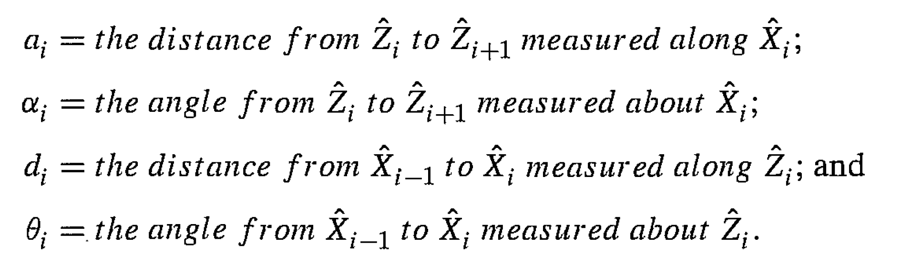
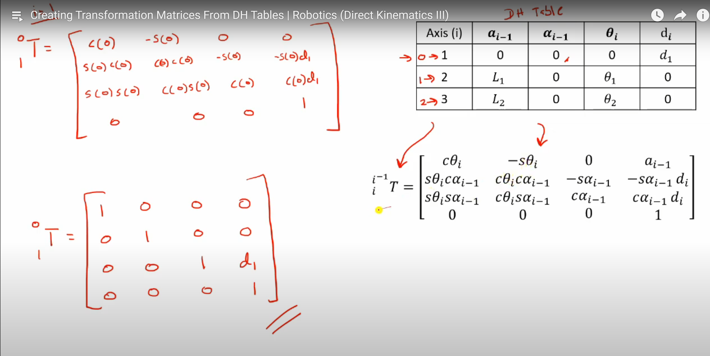

screw asix

prismatic

# kinematics 

the forward kinematics problem is to find the configuration of the end effector ([b]-frame) relative to the [s]-frame given the vector of joint angles theta (joint variable)

forward kinematics: x = e(q)
inverse kinematics: q = e'(x)
ref: https://www.youtube.com/watch?v=jtei695t4VY

## link parameters

## DH table to transformation matrix

## vector of joint variables
joint variables (q)
q = [q1, q2, q3]
for revolute joints, q_i = theta_i
for prismatic joints, q_i = distance_i

# jacobian matrix and singularities
jacobian matrix is the velocity of the joint in the system

e.g. V = [x', y', z'] (cartesian space) = [v, w] (joint space where v = linear and w = angular) = J [theat1, theat2] 

# Dymanic

space-frame transformation, it premultiplies M -> e * M

body-frame transformation, it postmultiplies M -> M * e

## lagrange formular

L = K-P (k = kinetic energy and P = potential energy)
K = 0.5*m*v^2 (where m = mass, v = velocity)
k(q, q') = 0.5*q'T*M(q)*q'

ref: https://www.youtube.com/watch?v=QN-Awth50aA

## Newton-Euler Formulation
in the Lagrangian formulation we treat the manipulator as
a whole and perform the analysis using a Lagrangian function (the difference between the
kinetic energy and the potential energy). In contrast, in the Newton-Euler formulation we
treat each link of the robot in turn, and write down the equations describing its linear motion
and its angular motion. Of course, since each link is coupled to other links, these equations
that describe each link contain coupling forces and torques that appear also in the equations
that describe neighboring links. By doing a so-called forward-backward recursion, we are
able to determine all of these coupling terms and eventually to arrive at a description of the
manipulator as a whole. Thus we see that the philosophy of the Newton-Euler formulation
is quite different from that of the Lagrangian formulation.

calculation rotational velocity (w) -> linear acceleration -> calcuatte force and torque on a link

# static force
https://www.youtube.com/watch?v=R7FGiA9WF-Y

# manipulator dynamic
## inertia tensor 
tensor of  gives us an idea about how the mass is distributed in a rigid body

## intertia matrix M(q)
- the inertia matrix is symmetric and positive definite

## Mass moment of inertia 
 a body’s resistance to a change in its rotation direction or the angular momentum
 
## linear control
https://www.bilibili.com/video/BV1p7411m7Za?p=21&spm_id_from=pageDriver

open-loop control/ feedforward control
there is no sensing of the actual joint position to close a feedback loop
- if there is ever any error in the joint position, however, this open-loop approach cannot recover

closed-loop control
- with feedback

## ref
https://www.pdfdrive.com

## unknown
https://www.youtube.com/watch?v=_GIk3vhiU3c
